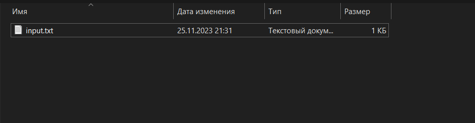
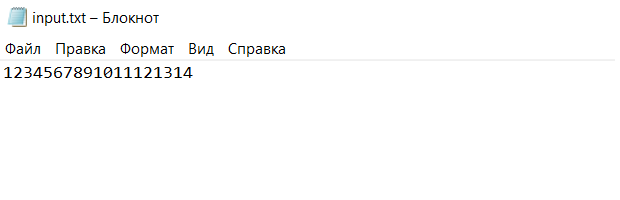
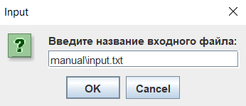
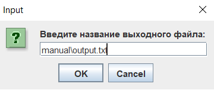
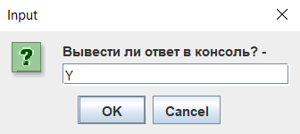
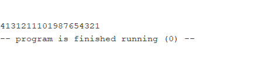
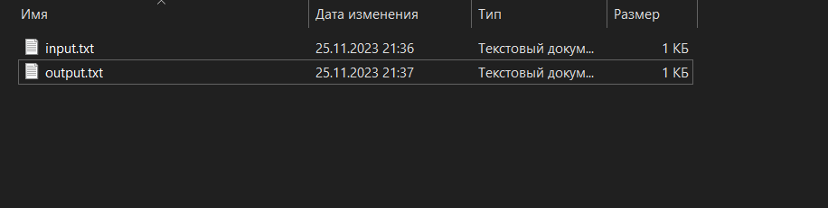
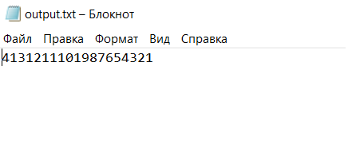
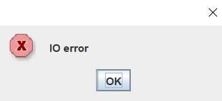
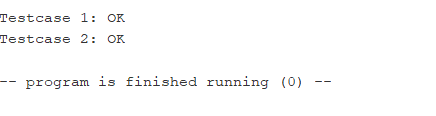

# ИДЗ №3

**Выполнил:** Тимергалин Тимур Маратович, группа БПИ227

## Запуск

Компиляция проводилась с флагами "Initialize program counter to global 'main' if defined" и "assemble all files currently open" (и никакими другими).

Чтобы запустить **основную программу**, открыть:

- idz3.asm
- io.asm
- reverse.asm

Чтобы запустить **тестовую программу**, открыть:

- idz3_test.asm
- io.asm
- reverse.asm

## Условие

**Вариант 9:** Разработать программу, которая «переворачивает на месте» заданную ASCII-строку символов (не копируя строку в другой буфер).

## Решение

### Содержание

**Внимание:** эмулятор *RARS* работает с файлами кодировки *cp1251*, которая некорректно отображается в браузере. Скриптом  *convert_encoding.py* файлы были перекодированы в *utf-8*, результат лежит в папке *utf8*.

Решение состоит из следующих файлов:

- **convenience.inc** - макрос-библиотека с "quality-of-life" макросами;
- **idz3.asm** - исполняемый файл основной программы;
- **idz3_test.asm** - исполняемый файл тестовой программы;
- **io.asm** - библиотека подпрограмм для ввода-вывода данных, необходимых для этой задачи;
- **io.inc** - "интерфейс" **io.asm** - макрос-библиотека с макросами для удобного вызова подпрограмм из **io.asm**;
- **reverse.asm** - библиотека подпрограмм, необходимых для выполнения разворота строки из файла;
- **reverse.inc** - "интерфейс" **reverse.asm** - макрос-библиотека с макросами для удобного вызова подпрограмм из **reverse.asm**;
- **mfunc.inc** - макрос-библиотека для удобной работы с подпрограммами;
- **auto/*.txt** - файлы для автоматического тестирования;
- **auto/test.py** - скрипт, генерирующий правильные ответы для автоматического тестирования

#### Как проверять это задание

Подробное описание работы программы присутствует в комментариях в коде. Рекомендуемый порядок для проверки решения:

1. **mfunc.inc** и **convenience.inc** - эти файлы использовались в пердыдущих работах и остались практически неизмененными;
2. **io.asm** - здесь представлены подпрограммы для открытия файлов и считывания из них - первого этапа задачи. Рекомендуется начать проверку именно с этого файла, так как специфика решения заключается именно в способе считывания из файла;
3. **io.inc** - чтобы знать, какие макросы будут использоваться для вызова подпрограмм из **io.asm**;
4. **reverse.asm** - здесь представлено решение непосредственно поставленной задачи - разворота строки;
5. **reverse.inc** - чтобы знать, какие макросы будут использоваться для вызова подпрограмм из **reverse.asm**;
6. **idz3.asm** - непосредственно основная программа.

### Соответствие решения требованиям

Представленное решение подразумевает оценку в 10 баллов.

#### Критерии на 10 баллов

- Программа разбита на несколько единиц компиляции;
- Ввод-вывод представлен единым модулем (**io.asm**);
- Макросы выделены в отдельную библиотеку (и даже не одну!);
- Используются диалоговые окна *RARS*.

#### Критерии на 9 баллов

- В программу добавлены макросы ввода-вывода данных;
- Тела подпрограмм обёрнуты в макросы;
- Добавлена программа дял автоматического тестирования с использованием макросов.

#### Критерии на 8 баллов

- Реализован вывод результата в консоль по требованию пользователя;
- Реализовано автоматизированное тестирование программы (**idz3_test.asm**);

#### Критерии на 6-7 баллов

- В подпрограммах используются локальные переменные;
- Для чтения файлов используется буфер размером 512 байт, поддерживается чтение файлов до 10 кб (и даже больше!);
- Возврат значений из подпрограмм соответствует общепринятым соглашениям.

#### Критерии на 4-5 баллов

- Приведено решение на языке assembler;
- Ввод данных осуществляется с клавиатуры;
- Вывод данных осуществляется в консоль;
- В программе присутствуют комментарии;
- Были проведены тестовые запуски программы (см. Результаты запуска и тестирования);
- Файлы, используемые для тестировки, приложены (**auto/**);
- Программа не падает при чтении файла.

## Результаты запуска и тестирования

### idz3.asm

**Содержимое папки manual перед запуском программы**

 

**Содержимое manual/input.txt**

 

**Ввод данных в программу**

 

 

 

**Вывод программы в консоль**

**Содержимое папки manual после заверешения программы** 

 

**Содержимое manual\output.txt после завершения программы**

 

**Вывод в случае ошибки при чтении файла/записи в файл**

 

### idz3_test.asm

 